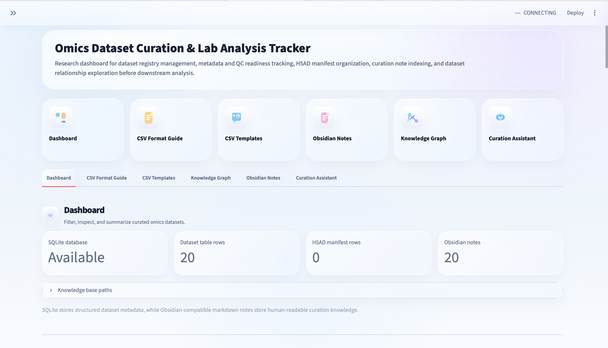
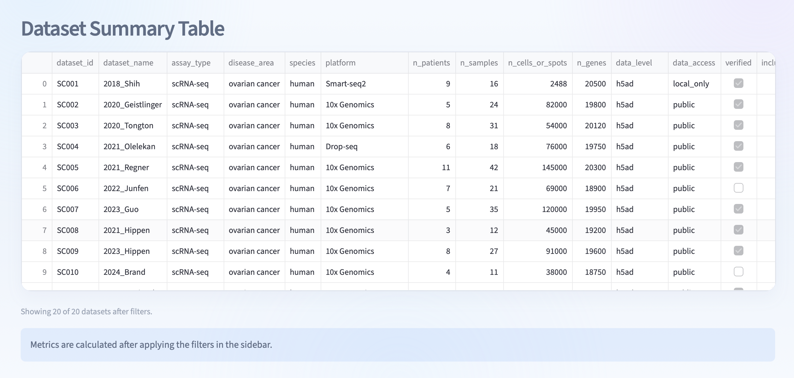
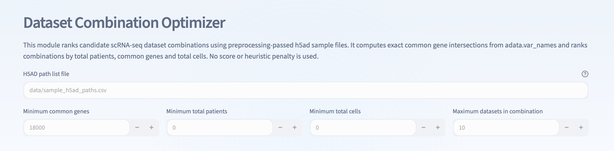
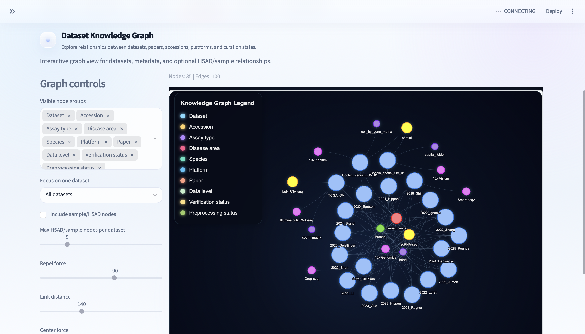

# Omics Dataset Curation and Lab Analysis Tracker

A Streamlit-based research dashboard for organizing omics datasets before downstream analysis.

This project helps track public or internal omics datasets, metadata completeness, QC availability, H5AD file paths, analysis-readiness status, curation notes, and dataset relationships. It combines a structured CSV and SQLite registry with Obsidian-compatible markdown notes, SQLite full-text retrieval, and an interactive knowledge graph.

## Screenshots

### Dashboard overview

### Dataset summary

### Dataset combination optimiser

### Interactive Knowledge Graph

## Project purpose

Bioinformatics projects often become difficult before the actual analysis starts. Dataset information is usually scattered across papers, GEO accessions, local folders, Excel files, QC reports, H5AD files, and personal notes.

This tool provides a structured human-in-the-loop workflow for dataset curation.

The user curates dataset metadata once in CSV format. The tool then automatically converts that structured information into:

- a Streamlit dashboard
- a SQLite dataset registry
- Obsidian-compatible curation notes
- a searchable note index
- a SQL-backed curation assistant
- an interactive knowledge graph

## What problem does this solve?

The project is designed for the upstream dataset organization phase of omics analysis.

It helps answer questions such as:

- Which datasets are available?
- Which datasets have paper links, accessions, and data links?
- Which datasets are already in H5AD format?
- Which datasets have QC reports?
- Which datasets have missing metadata?
- Which datasets are verified?
- Which datasets should be included in downstream analysis?
- Which samples have local H5AD files?
- Which datasets share the same disease area, assay type, species, platform, or status?
- Which curation notes mention H5AD, metadata, QC, preprocessing, or platform information?

## What this tool does

The dashboard supports:

- omics dataset registry management
- standardized CSV input templates
- SQLite-backed metadata storage
- H5AD manifest tracking
- QC report path tracking
- analysis-readiness status tracking
- Obsidian-compatible markdown note export
- SQLite full-text search over curation notes
- grounded retrieval answers with source paths
- interactive dataset knowledge graph visualization
- dataset combination planning before downstream analysis

## What this tool does not do

This project is not a downstream omics analysis pipeline.

It does not perform:

- FASTQ processing
- Cell Ranger execution
- STARsolo or kallisto-bustools execution
- clustering
- cell type annotation
- differential expression analysis
- pathway enrichment analysis
- biological interpretation
- Seurat or Scanpy replacement analysis

The goal is to organize, document, and evaluate datasets before downstream analysis.

## Why CSV curation is still manual

This tool does not try to fully automate biological dataset curation, because public omics metadata is often incomplete, inconsistent, or project-specific.

For example, public datasets may have:

- unclear sample names
- inconsistent metadata columns
- missing patient annotations
- missing QC reports
- different file structures
- unclear sample-to-patient mapping
- inconsistent H5AD or raw matrix naming
- incomplete supplementary files
- project-specific inclusion criteria

For this reason, the project uses a human-in-the-loop design.

The user reviews and curates the dataset metadata once in CSV format. After that, the tool automatically builds the registry, dashboard, markdown notes, search index, retrieval assistant, and knowledge graph.

## Main workflow

The workflow is:

1. Fill CSV templates with dataset information
2. Save the completed CSV files under the data folder
3. Import CSV files into SQLite
4. Export dataset notes to an Obsidian-compatible vault
5. Index the notes into SQLite full-text search
6. Run the Streamlit dashboard
7. Explore datasets, notes, retrieval results, and knowledge graph

Workflow diagram:

CSV templates
→ SQLite registry
→ Obsidian markdown notes
→ SQLite full-text note index
→ Curation Assistant
→ Knowledge Graph
→ Dataset readiness review

## Installation from zero

A normal user does not need to manually create folders or copy files.

The standard installation workflow is:

    GitHub repository
    → git clone
    → create Python environment
    → install requirements
    → build local SQLite database
    → export Obsidian notes
    → index notes
    → launch Streamlit app

Clone the repository from GitHub:

    git clone https://github.com/ilbilgeulukoy/Omics-dataset-curation-and-analysis-tracker.git

Enter the project folder:

    cd omics-dataset-curation-and-lab-analysis-tracker

Create a local Python virtual environment:

    python3 -m venv .venv

Activate the environment:

    source .venv/bin/activate

Upgrade pip:

    python -m pip install --upgrade pip

Install project dependencies:

    python -m pip install -r requirements.txt

The `.venv` folder is a local Python environment created only on the user's computer. It is not committed to GitHub.

## Option A: run with demo data

The project can run without private lab data.

This is the recommended first test for a new user.

If `data/datasets.csv` is not present, the app uses the demo file:

    data/mock_datasets.csv

To initialize the demo database and run the app:

    python scripts/import_csv_to_sqlite.py

    python scripts/export_datasets_to_obsidian.py

    python scripts/index_obsidian_notes_to_sqlite.py

    streamlit run app.py

Then open the local Streamlit URL shown in the terminal.

Usually:

    http://localhost:8501

This demo mode lets a collaborator test the dashboard, Obsidian note export, SQL-backed Curation Assistant, and Knowledge Graph without filling any CSV files first.

## Option B: run with your own datasets

To use real lab or project data, the user fills the CSV templates.

Templates are provided in:

    templates/

The main template is:

    templates/datasets_template.csv

After filling it, save it as:

    data/datasets.csv

Optional files can also be added:

    data/sample_metadata.csv
    data/qc_summary.csv
    data/sample_h5ad_paths.csv

Then rebuild the local registry and launch the app:

    python scripts/import_csv_to_sqlite.py

    python scripts/export_datasets_to_obsidian.py

    python scripts/index_obsidian_notes_to_sqlite.py

    streamlit run app.py

Only `data/datasets.csv` is essential for the main dataset registry. The other files add sample-level, QC-level, and H5AD-level tracking.

The CSV curation step is intentionally human-in-the-loop because public omics metadata is often incomplete, inconsistent, or project-specific.

## Input files

### 1. datasets.csv

This is the main dataset registry.

Typical columns include:

    dataset_id
    dataset_name
    accession
    paper_title
    paper_link
    data_link
    doi
    publication_year
    first_author
    assay_type
    disease_area
    species
    platform
    chemistry_used
    n_patients
    n_samples
    n_cells_or_spots
    n_genes
    data_level
    data_access
    verified
    include_for_analysis
    primary_data_path
    metadata_path
    qc_report_path
    data_preparation_status
    data_verification_status
    preprocessing_status
    data_verification_comment
    notes

### 2. sample_metadata.csv

Optional sample-level metadata.

Typical columns include:

    dataset_id
    sample_id
    patient_id
    condition
    tissue
    sample_type
    batch
    notes

### 3. qc_summary.csv

Optional QC tracking file.

Typical columns include:

    dataset_id
    sample_id
    n_cells
    n_genes
    mitochondrial_percent
    doublet_rate
    qc_status
    qc_report_path
    notes

### 4. sample_h5ad_paths.csv

Optional H5AD manifest.

Typical columns include:

    dataset_id
    dataset_name
    sample_id
    h5ad_path

This file is useful when each sample has a separate processed H5AD file.

## Outputs

The project produces several outputs.

### Streamlit dashboard

Main user interface.

It displays:

- dataset overview
- filtering tools
- summary metrics
- assay and disease summaries
- dataset tables
- CSV format guide
- template downloads
- Obsidian notes browser
- Curation Assistant
- Knowledge Graph

### SQLite database

Generated file:

    data/omics_tracker.db

This database can contain:

    datasets
    h5ad_files
    note_chunks
    note_chunks_fts

The database is generated locally and should usually not be committed to GitHub.

### Obsidian-compatible vault

Generated folder:

    obsidian_vault/

Dataset notes are exported as markdown files:

    obsidian_vault/datasets/SC001.md
    obsidian_vault/datasets/SC002.md
    obsidian_vault/datasets/SP001.md

These notes can be opened directly in Obsidian or browsed inside the Streamlit app.

### Knowledge graph

Generated HTML file:

    reports/knowledge_graph.html

The graph shows relationships between:

- datasets
- accessions
- papers
- assay types
- disease areas
- species
- platforms
- data levels
- verification status
- preprocessing status
- samples
- H5AD files

### Curation Assistant results

The SQL-backed Curation Assistant retrieves evidence from indexed Obsidian notes.

Example questions:

    Which datasets mention H5AD?

    Which datasets have QC reports?

    Which datasets are spatial transcriptomics?

    Which datasets mention ovarian cancer?

    Which datasets use 10x Genomics?

    Which datasets have public data access?

The assistant returns:

- grounded answer
- retrieved evidence sections
- source note paths

## SQL-backed Curation Assistant

The assistant is a lightweight retrieval system.

It works as follows:

1. Markdown notes are split into sections
2. Sections are stored as chunks in SQLite
3. SQLite full-text search indexes the chunks
4. A user asks a curation question
5. Matching note sections are retrieved
6. The app displays a grounded answer with sources

This is not a full semantic LLM RAG system yet.

Current retrieval layer:

- markdown section chunking: yes
- SQLite storage: yes
- SQLite full-text search: yes
- source display: yes
- embeddings: no
- vector database: no
- LLM answer synthesis: no

A future version could add semantic embeddings and vector search.

## Knowledge Graph

The Knowledge Graph converts the structured dataset registry into an interactive network.

It helps users visually inspect how datasets connect to:

- disease areas
- assay types
- platforms
- species
- accessions
- papers
- data availability
- preprocessing status
- H5AD files

This makes the project useful not only as a table-based tracker but also as a lightweight lab knowledge system.

## Repository structure

Typical structure:

    app.py
    requirements.txt
    README.md
    QUICKSTART.md
    src/
    scripts/
    templates/
    data/
    obsidian_vault/
    reports/

Important source modules:

    src/knowledge_status.py
    src/knowledge_graph.py
    src/obsidian_notes.py
    src/obsidian_search.py
    src/rag_engine.py
    src/ui_components.py

Important scripts:

    scripts/import_csv_to_sqlite.py
    scripts/export_datasets_to_obsidian.py
    scripts/index_obsidian_notes_to_sqlite.py

